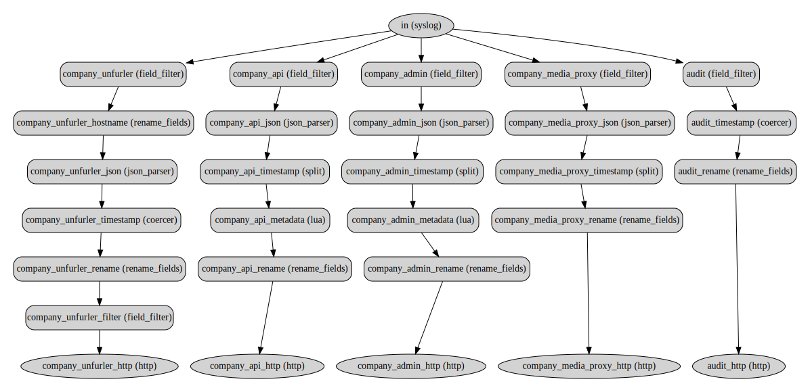

# Vector Config to DOT

Visualise your [Vector](https://vector.dev) pipeline.

This is a tool to generate a Graphviz DOT file from a set of Vector configuration files.

## Usage

```shell
> pipenv run ./main.py fixtures/multiple_files_01/*
digraph {
        in [label="in (syslog)" shape=ellipse style="rounded, filled"]
        company_api [label="company_api (field_filter)" shape=box style="rounded, filled"]
        company_api_json [label="company_api_json (json_parser)" shape=box style="rounded, filled"]
        company_api_timestamp [label="company_api_timestamp (split)" shape=box style="rounded, filled"]
        company_api_metadata [label="company_api_metadata (lua)" shape=box style="rounded, filled"]
        company_api_rename [label="company_api_rename (rename_fields)" shape=box style="rounded, filled"]
        company_admin [label="company_admin (field_filter)" shape=box style="rounded, filled"]
--snip--
```

You can also generate an image if you have `dot` installed:

```shell
pipenv run ./main.py fixtures/multiple_files_01/* | dot -Tsvg > output.svg
```


